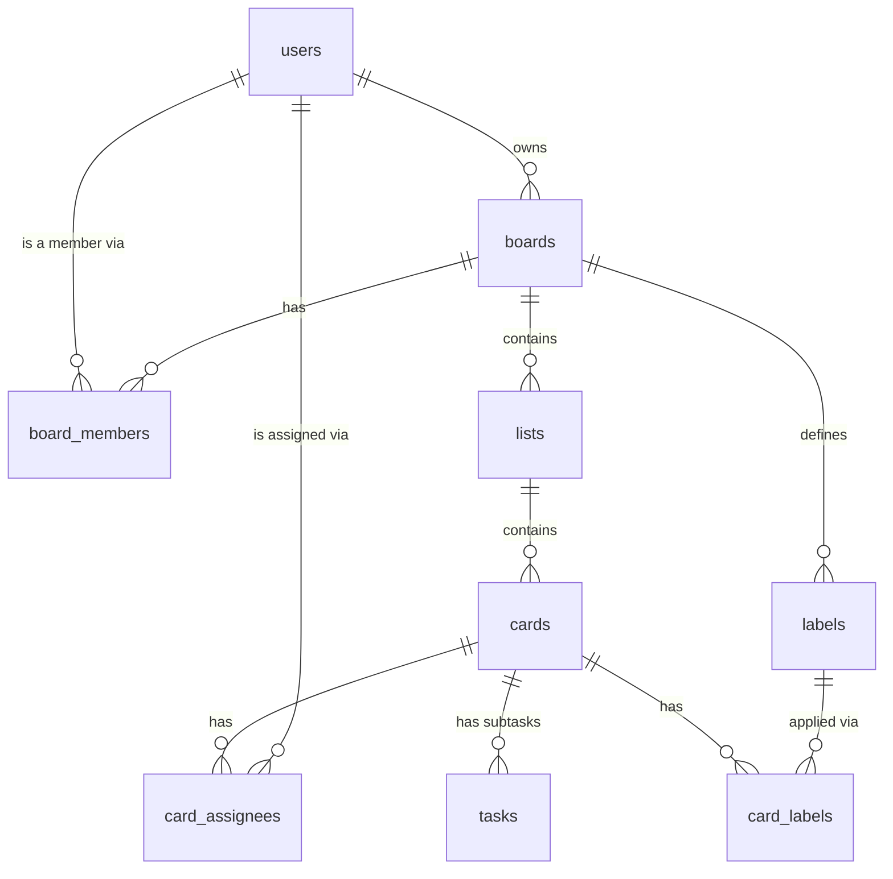

# Database Schema

PostgreSQL. Full source of truth for the schema is [`back-end/sql/create_tables.sql`](back-end/sql/create_tables.sql) (⚠️ that file *drops and recreates* every table — never rerun it against data you want to keep. To change a live table, write an `ALTER TABLE` instead). Sample data lives in [`back-end/sql/population.sql`](back-end/sql/population.sql).

**"Used by backend?"** below means: is there actually a route in `back-end/app/routes/` that queries or writes this table today. A "No" doesn't mean the table is dead — it means the schema was planned ahead of the feature that will use it.

## At a glance

Hierarchy in one line: **`users` → `boards` → `lists` → `cards`**, with `tasks` as subtasks *inside* a card, and `labels`/`board_members`/`card_assignees` as side-tables hanging off `boards`/`cards`.

## Table reference

### `users`
The account. Everything else in the app ultimately traces back to a `users.id`.
- Login identity: `user_account` (unique) + `password_hash` (argon2)
- `email`, `first_name`, `last_name` — profile fields, editable via `PUT /user/profile`
- `active` — soft-delete flag (see below)
- **Used by backend:** ✅ Yes (`auth.py`)

### `boards`
A Kanban board (e.g. "Groceries & Home"). Top-level container a user creates.
- `owner_id → users.id` — who created it; the backend currently authorizes almost everything by checking `owner_id = current_user['id']`
- `active` — soft-delete flag
- **Used by backend:** ✅ Yes (`board.py`)

### `board_members`
Join table for **multi-person collaboration** on a board — `(board_id, user_id, role)`, where `role` is `'owner'` or `'member'`.
- This is the mechanism that would let a board be shared with more than one person.
- **Used by backend:** ❌ No. The table and its sample data exist, but every route still checks `boards.owner_id` directly instead of joining through `board_members` — so today a board only has exactly one person who can see it, its actual owner. Sharing a board with someone else is schema-ready but not implemented.

### `lists`
A column within a board (e.g. "To Do" / "Doing" / "Done").
- `board_id → boards.id`
- `position` — integer used to order lists left-to-right within a board
- `active` — soft-delete flag
- **Used by backend:** ✅ Yes (`board.py`)

### `cards`
A single task/todo item, living inside a list.
- `list_id → lists.id`
- `position` — integer used to order cards top-to-bottom within a list
- `description`, `due_date`, `completed` — the fields editable from the Card Detail Modal
- `active` — soft-delete flag
- **Used by backend:** ✅ Yes (`board.py`)

### `card_assignees`
Join table — which `users` are assigned to a `cards` row. `(card_id, user_id)`.
- Would support "assign this card to a teammate," which depends on multi-person boards (`board_members`) existing first.
- **Used by backend:** ❌ No.

### `tasks`
Subtasks living *inside* a card (a checklist within a card — e.g. card "Plan trip" → subtasks "Book flights", "Book hotel").
- `card_id → cards.id`, `content`, `is_completed`, `position`
- **Used by backend:** ❌ No. There used to be a `back-end/app/routes/task.py` touching a similarly-named concept, but it was leftover scaffolding from the very first commit that never actually queried this table (and had no auth checks) — it was removed. This table itself is still schema-ready for a real subtask feature.

### `labels`
A named, coloured tag scoped to one board (e.g. "Bug" / red, "Frontend" / blue). Board-scoped, not global — two different boards can each have their own "Urgent" label.
- `board_id → boards.id`, `name`, `color`
- **Used by backend:** ❌ No. Planned in [`todo-app-spec.md`](todo-app-spec.md) (§4.5) but no API routes exist yet.

### `card_labels`
Join table — which `labels` are applied to which `cards`. `(card_id, label_id)`, many-to-many.
- **Used by backend:** ❌ No. Same status as `labels` — schema exists, routes don't.

## Soft deletes

`users`, `boards`, `lists`, and `cards` all have `active BOOLEAN NOT NULL DEFAULT TRUE`. Deleting one of these sets `active = false` — the app never issues a hard `DELETE` on them. Every `SELECT` against these tables should filter `WHERE active = true`.

`board_members`, `card_assignees`, `tasks`, `labels`, and `card_labels` don't have an `active` column — since they're join/detail tables, they rely on `ON DELETE CASCADE` from their parent instead (e.g. delete a `boards` row → its `labels` and `board_members` rows go with it automatically).
